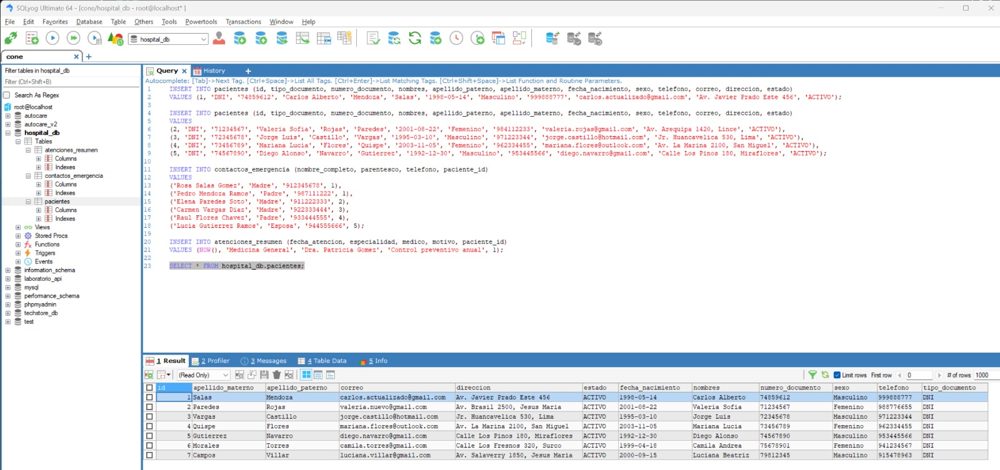
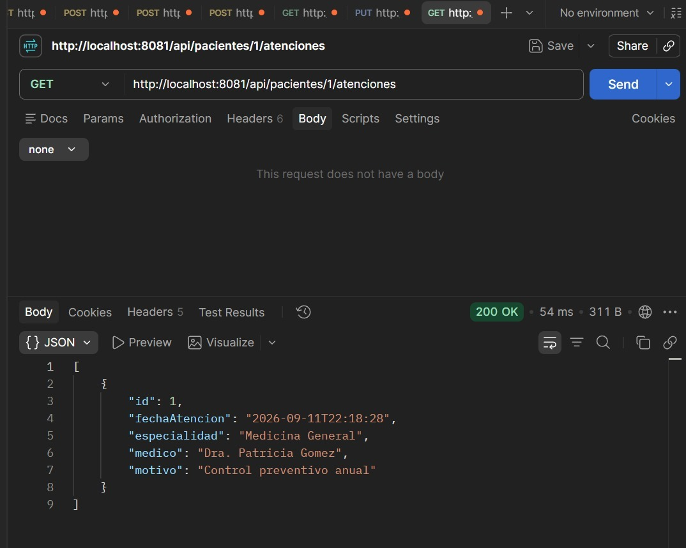
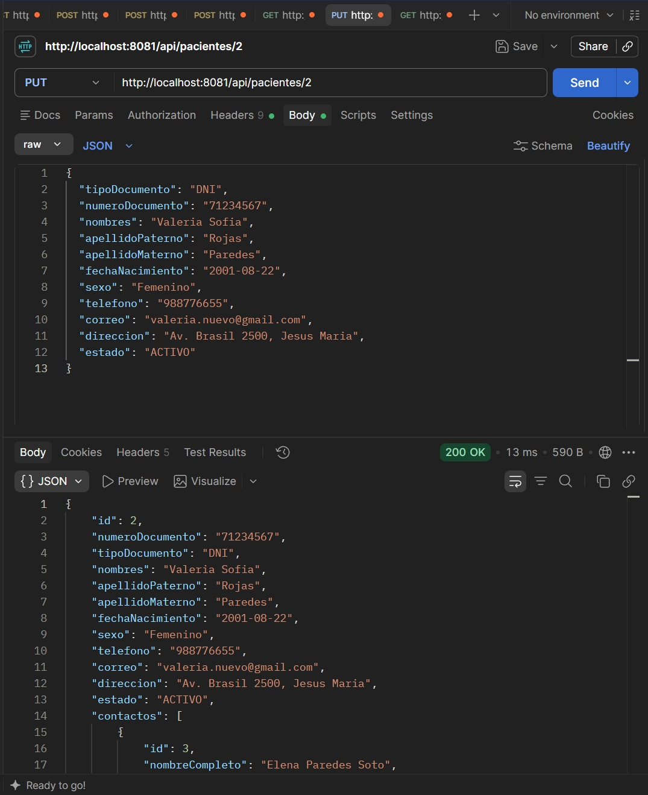
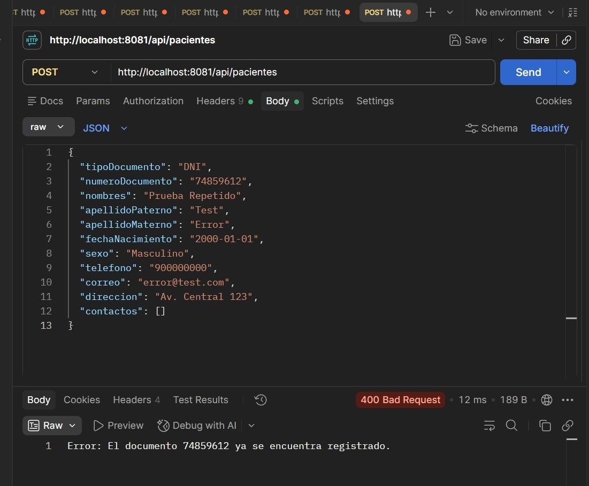
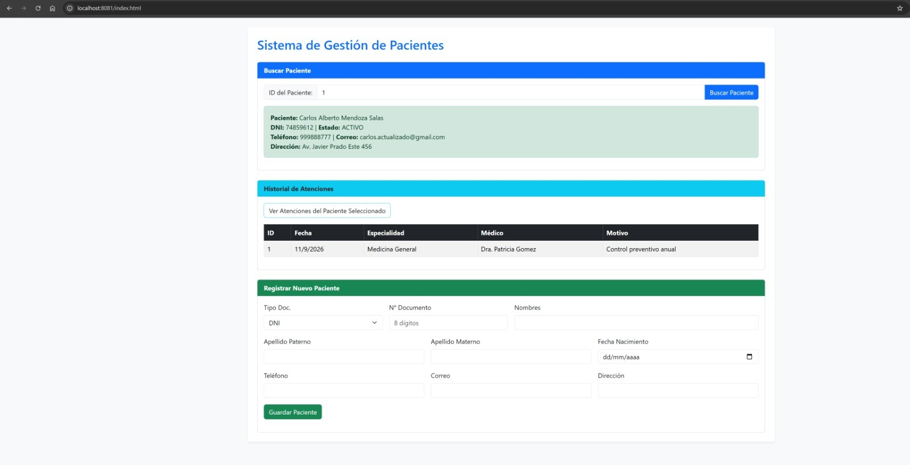

# Sistema de Gestión de Pacientes - Evaluación 01
---

## 📝 Descripción del Desarrollo Realizado

El proyecto se desarrolló siguiendo una arquitectura por capas (Controlador, Servicio, Repositorio y Modelo) para garantizar un código modular y mantenible:

1. **Configuración de Base de Datos y Entorno:**
   * Se configuró la conexión a MySQL (`hospital_db`) en `application.properties` con soporte de zona horaria local y dialecto Hibernate.
   * Se asignó el puerto de ejecución alternativo **8081** para evitar colisiones con servicios locales predeterminados.
   * Se ejecutó el script inicial con la estructura de tablas y 5 registros semilla de pacientes, sus contactos de emergencia y atenciones médicas.

2. **Capa de Modelo y Persistencia (JPA/Hibernate):**
   * Se definieron las entidades principales: `Paciente`, `ContactoEmergencia` (relación `@OneToMany`) y `AtencionResumen`.
   * Se implementaron los repositorios extendiendo de `JpaRepository` para operaciones CRUD y consultas personalizadas por documento y paciente.

3. **Lógica de Negocio y Controladores RESTful:**
   * **RF-PAC-01 / RF-PAC-04:** Registro de pacientes y contactos de emergencia asociados.
   * **RF-PAC-02:** Validación de documentos duplicados evitando inconsistencias en la base de datos.
   * **RF-PAC-06:** Consulta detallada de paciente por identificador ID.
   * **RF-PAC-07:** Consulta del historial de atenciones médicas asignadas a un paciente.
   * **RF-PAC-08:** Actualización de datos de contacto asegurando la integridad de campos obligatorios (`NOT NULL`).
   * Se habilitó el soporte para peticiones cruzadas (`@CrossOrigin`) para permitir la integración con el cliente web.

4. **Integración del Frontend:**
   * Se creó una interfaz responsiva en `src/main/resources/static/index.html` consumiendo la API mediante JavaScript asíncrono (`fetch`).
   * Permite realizar búsquedas por ID en tiempo real, visualizar el historial clínico en tablas dinámicas y registrar nuevos pacientes desde formularios interactivos.

---

## 🛠️ Tecnologías Utilizadas

* **Lenguaje:** Java 21 (Adoptium Temurin)
* **Framework Backend:** Spring Boot 4.1.1
* **ORM:** Spring Data JPA / Hibernate 7.4.5
* **Base de Datos:** MySQL
* **Frontend:** HTML5, CSS3, Bootstrap 5.3, JavaScript (Fetch API)
* **Herramientas de Desarrollo:** IntelliJ IDEA, SQLyog, Postman, Git & GitHub

---

## 🚀 Instrucciones de Ejecución

1. **Base de Datos:**
   * Asegurarse de tener activo el servicio de MySQL.
   * Crear y poblar la base de datos ejecutando el script en `hospital_db`.

2. **Backend:**
   * Abrir el proyecto en IntelliJ IDEA.
   * Ejecutar la clase `DemoApplication.java`.
   * El servicio levantará en: `http://localhost:8081`

3. **Frontend:**
   * Ingresar desde cualquier navegador a: `http://localhost:8081/index.html`

---

## 📸 Evidencias del Funcionamiento (Pantallazos)

### 1. Base de Datos (MySQL / SQLyog)
*Visualización de los registros iniciales y las tablas del sistema (`pacientes`, `contactos_emergencia`, `atenciones_resumen`).*

---

### 2. Pruebas en Postman (API REST)

#### A. Consulta de Historial de Atenciones (RF-PAC-07)
*Petición `GET /api/pacientes/1/atenciones` retornando status `200 OK` con las atenciones del paciente.*

#### B. Actualización de Paciente (RF-PAC-08)
*Petición `PUT /api/pacientes/2` actualizando datos de contacto sin alterar restricciones de integridad.*

#### C. Validación de Documento Duplicado (RF-PAC-02)
*Petición `POST /api/pacientes` intentando registrar un número de documento ya existente (`400 Bad Request`).*

---

### 3. Ejecución FrontEnd (Navegador Web)
*Interfaz gráfica en funcionamiento mostrando la consulta por ID, la tabla de atenciones y el registro de un nuevo paciente.*

